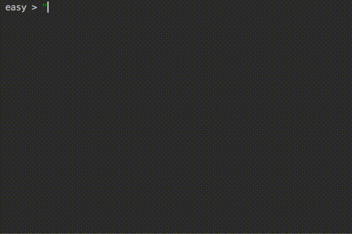

# EasyLang
It is a programming language that has begun to be developed for testing purposes.



Assignment operations
```
data1 = 1
data2 = true
data3 = .555
data4 = "hello world"
data5 = 1024
```

Function descleration
```
func HelloWorld()
    return "hello world"

func SumTwoNumber(a, b)
    return a + b

func SumAndPrint(a, b)
{
    sum = a + b
    print (sum)
    return sum
}
```

Function call
```
HelloWorld()
HelloWorld _
SumAndPrint(10, 20)

print data1
print (data1, data2, data3, data4, data5)
```
You can call function with '_' for parameterless function.

If statement
```
if data1 > 1 then
    print "bigger"
else
    print "opssss"

if data1 == 1 then
    print "equal"
else
    print "not equal"
```

Loop
```
i -> 0..100 
    print i + data5

i -> data1..data5 
{
    print i
    print (i, data1)
}
```

Fibonacci Code Example.
```
func fibonacci(num) 
{ 
    if num <= 1 then 
        return 1 
        
    left = fibonacci(num - 1)
    right = fibonacci(num - 2) 
    return left + right 
}

fibonacci(10)
```

Result
```
(INTEGER) 89
```

Internal functions
```
isEmpty
isBool
isInteger
isDouble
isBool
isString

toBool
toInteger
toDouble
toBool
toString

print
readline
```
